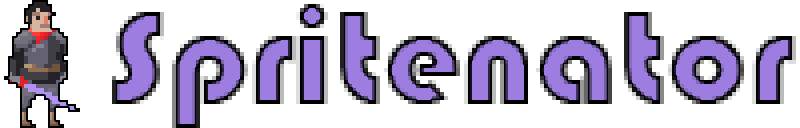
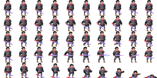

# Spritenator

Spritenator is a micro lib that lets you turn regular img element into Spritenators.

No dependencies, no jQuery, just plug and play! (pun intended)

[Live example](https://ronenness.github.io/spritenator/).


## Install

Via bower:

```
bower install spritenator
```

Via npm

```
npm install spritenator
```

Or simply download the js files from /dist/ in this repo and include it in a script tag.

## Usage Example

Lets start with a basic example.

To create a sprite, you first need to create an image element inside a div, and use your spritesheet as the image src:

```HTML
<div id="sprite" style="width:100px; height:100px;">
    
</div>
```

Now to init the sprite:

```JavaScript
// first define the different animations in the sprite-sheet (see file example/sprite.png for more info)
// note: steps goes from top-left corner to bottom right (starting with 0)
var animations = {
    "idle": Spritenator.animation({steps: [0,1,2,3,4,5,6,7,8,9], fps: 5}),
    "taunt": Spritenator.animation({steps: [10,11,12,13,14,15,16,17,18,19], fps: 12, next: "idle"}),
    "hop": Spritenator.animation({steps: [20,21,22,23,24,25,26,27,28,29], fps: 12}),
};

// init sprite on the div element
// note: the "{x: 10, y: 5}" param define the spritesheet size: 10 columns and 5 rows of animation steps. 
var elem = document.getElementById("sprite");
Spritenator.create(elem, {x: 10, y: 5}, animations);

```

## Spritenator API

After seeing a simple example, lets dive into the API.

### Spritenator.animation()

To create a new sprite you first need to define a dictionary with all the spritesheet animations. 
You use ```Spritenator.animation()``` to define each animation sequence. 

For example:

```JavaScript
var animations = {
    "some_anim": Spritenator.animation({steps: [0,1,2,3,4,5,6], fps: 5, loop: true}),
};
```

Will define a sprite with a single animation, "some_anim", that will play steps 0-6 in an endless loop with 5 frames per second.

The function ```Spritenator.animation()``` accept a single dictionary as param, with the following options:

#### steps

A list with the animation sequence steps. 
Every value in this list is a step index, counted from top-left corner.

#### delays

Optional list of extra delays, in milliseconds, to add to each animation step.

For example if you want the third step to halt for 1.5 seconds, you can set [0, 0, 1500] as delays (the two 0's in the beginning of the list is to skip step 1 and 2). 

#### fps

Frames per seconds, determine the general animation speed (delays, if provided, are added on top of the basic speed).

#### loop

If true, this animation will play in loops (default to true). If false, animation will play once and stop.

#### next

Optional string or function to determine the next animation to play right after this one ends.

For example, you can define an animation sequence that will play once and then switch to an animation called "idle".

#### startDelay

Delay, in milliseconds, to add to first animation step.

#### endDelay

Delay, in milliseconds, to add to last animation step.

#### onStart

Function to call whenever animation sequence starts playing.

#### onEnd

Function to call whenever animation sequence ends.

### Creating Sprites

Sprites are the most basic object of Spritenator. 
They attach to an existing div element and play animation sequences with it, using the internal img tag.

The function ```Spritenator.create()``` creates a new sprite instance. It requires the following params:

#### element

The div element to create the sprite from. Must be in the following format:

```HTML
<div id="some-id" style="width:100px; height:100px;">
    
</div>
```

Where ```sprite.png``` is your spritesheet file. Note: the containing div must define sprite size.

#### sheetSize

A dictionary with ```x``` and ```y```, representing the spritesheet size, eg how many columns and rows of animation steps it contains (note: spritesheets are assumed to have the same size for every animation step).
 
#### animations

The animations dictionary we defined above, using ```Spritenator.animation()```.

### Retrieving existing sprites

After you create a sprite instance you can always get it back from the dom element, using ```Spritenator.get()```:

```JavaScript
// assuming sprite was init on 'element' before.
var element = document.getElementById("my-id");
var sprite = Spritenator.get(element);
```

### Sprite API

Once you create a new sprite instance, you can use the following sprite API:

#### play (name, forceReset, next)

Start playing an animation sequence.

- name: the name of the animation to play (key from the animations dictionary).
- forceReset: if true will restart animation even if already playing it.
- next: can override the animation default 'next' param, and decide which animation to play after this sequence ends (can be a string or a callback).

#### reset function()

Reset current animation.

#### current()

Get the name of the animation currently playing.

#### destroy()

Destroy and cleanup this sprite. Note: image element will remain at its current state. 
If you need to remove the dom elements as well, its your responsibility.

#### speed [float]

Speed factor you can set to change the speed of all animations in sprite. For example, if you set

```JavaScript
sprite.speed = 3.0;
```

All animations in sprite will play x3 times faster.

#### paused [boolean]

If true, animation will pause until set to false.

#### step (time)

This function will advance the animation by a given time factor (in milliseconds).

It is used internally and normally you should not use it, but it might become handy for some special effects.

## What next

To learn more about Spritenator please see the [Live Example](https://ronenness.github.io/spritenator/), or you can explore the JavaScript file yourself (its really just one lightweight JS file).

## License

Spritenator is distributed under the MIT license and is free for any personal and / or commercial use.
